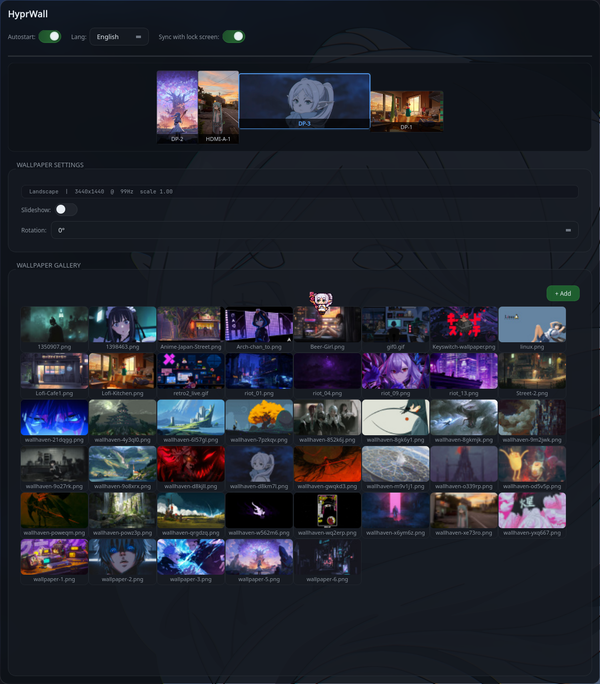

<div align="center">

# HyprWall

**A graphical wallpaper manager for [Hyprland](https://hyprland.org)**

Static, video, and GIF wallpapers with lock screen sync and slideshow support

[](https://github.com/Rainkord/HyprWall/blob/main/LICENSE)
[](https://aur.archlinux.org/packages/hyprwall-git)



</div>

---

## Features

- **Per-monitor wallpapers** — set different images on each display
- **Video & GIF wallpapers** — animated backgrounds via mpvpaper
- **Slideshow mode** — auto-rotate wallpapers with custom interval
- **Lock screen sync** — manage hyprlock wallpapers from the same app
- **Same wallpaper toggle** — instantly sync desktop and lock screen backgrounds
- **Gallery** — browse and manage your wallpaper collection with instant thumbnails
- **Multilingual** — English and Russian localization (persists on restart)
- **Autostart** — launch on login with a single toggle

## Requirements

| Dependency | Purpose |
|---|---|
| `qt6-base` | UI framework |
| `wayland` | Display protocol |
| `hyprpaper` | Static image wallpapers |
| `mpvpaper` | Video & GIF wallpapers |
| `hyprlock` | Lock screen management |
| `papirus-icon-theme` | Icons (optional) |

## Installation

### AUR (recommended)

```bash
yay -S hyprwall-git
```

### Manual build

```bash
git clone https://github.com/Rainkord/HyprWall.git
cd HyprWall
cmake -B build -DCMAKE_BUILD_TYPE=Release -DCMAKE_INSTALL_PREFIX=/usr
cmake --build build -j$(nproc)
sudo cmake --install build
```

## Usage

```bash
hyprwall
```

1. Select a monitor from the top bar
2. Pick a wallpaper from the gallery or add your own
3. Configure orientation, slideshow, and audio settings
4. Enable **Same wallpaper** to sync with lock screen

### Autostart

Enable the autostart toggle in the app settings. This creates
`~/.config/autostart/hyprwall.desktop` which launches `hyprwall --daemon` on login.

## Updating

```bash
cd HyprWall
git pull
cmake --build build -j$(nproc)
sudo cmake --install build
```

---

## Возможности

- **Обои для каждого монитора** — разные изображения на каждом дисплее
- **Видео и GIF обои** — анимированные фоны через mpvpaper
- **Режим слайд-шоу** — автоматическая смена обоев с настраиваемым интервалом
- **Синхронизация с экраном блокировки** — управление обоями hyprlock из того же приложения
- **Тумблер «Синхронизировать»** — мгновенная синхронизация обоев рабочего стола и экрана блокировки
- **Галерея** — просмотр и управление коллекцией обоев с быстрыми превью
- **Двуязычность** — русский и английский интерфейс (сохраняется при перезапуске)
- **Автозапуск** — включение одним тумблером при входе в систему

## Зависимости

| Пакет | Назначение |
|---|---|
| `qt6-base` | Фреймворк UI |
| `wayland` | Протокол дисплея |
| `hyprpaper` | Статические обои |
| `mpvpaper` | Видео и GIF обои |
| `hyprlock` | Управление экраном блокировки |
| `papirus-icon-theme` | Иконки (опционально) |

## Установка

### AUR (рекомендуется)

```bash
yay -S hyprwall-git
```

### Сборка вручную

```bash
git clone https://github.com/Rainkord/HyprWall.git
cd HyprWall
cmake -B build -DCMAKE_BUILD_TYPE=Release -DCMAKE_INSTALL_PREFIX=/usr
cmake --build build -j$(nproc)
sudo cmake --install build
```

## Использование

```bash
hyprwall
```

1. Выберите монитор на верхней панели
2. Выберите обои из галереи или добавьте свои
3. Настройте ориентацию, слайд-шоу и звук
4. Включите **Синхронизировать** для связи с экраном блокировки

### Автозапуск

Включите тумблер автозапуска в настройках приложения. Будет создан
`~/.config/autostart/hyprwall.desktop`, который запускает `hyprwall --daemon` при входе в систему.

## Обновление

```bash
cd HyprWall
git pull
cmake --build build -j$(nproc)
sudo cmake --install build
```

## Участие

Pull requests приветствуются. Для крупных изменений, пожалуйста, сначала откройте issue.

## Лицензия

[MIT](LICENSE)
